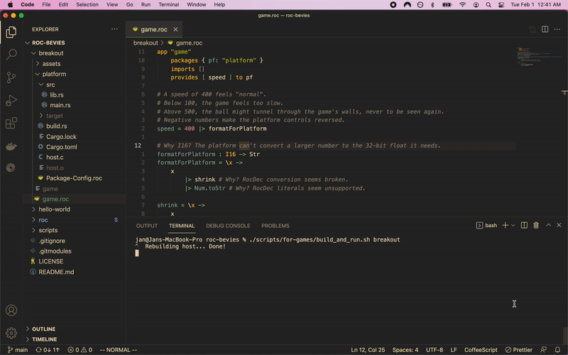

# Roc platforms for making games with Bevy

[Roc](https://roc-lang.org/)
+
[Bevy](https://bevyengine.org/)
= <3



## How to example

1. Set up a Roc environment

    ```sh
    nix-shell ./roc/shell.nix
    ```

1. Build Roc

    ```sh
    ./scripts/for-roc/build.sh
    ```

1. Build & run an example

    ```sh
    ./scripts/for-examples/build_and_run.sh breakout
    ```
